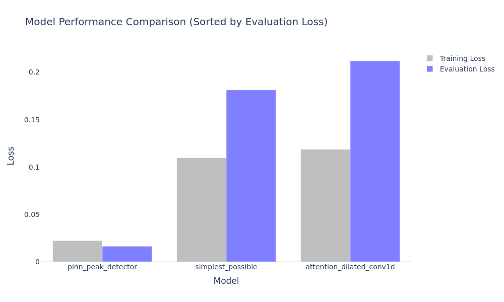

# Neural Network Signal Peak Detection

## Table of Contents
- [Overview](#overview)
- [Problem Statement](#problem-statement)
- [Solution Architecture](#solution-architecture)
  - [Model Implementations](#model-implementations)
  - [Components](#components)
  - [Training Framework](#training-framework)
- [Results](#results)
  - [Performance Overview](#performance-overview)
  - [Training Comparison](#training-comparison)
- [Project Usage](#project-usage)
  - [Setup](#setup)
  - [Configuration](#configuration)
  - [Running Experiments](#running-experiments)
- [Project Structure](#project-structure)
- [Future Work](#future-work)

## Overview
A neural network framework for detecting peaks in noisy signals, focusing on modularity and reproducibility. The project implements three different approaches with increasing complexity, from a simple baseline to a physics-informed neural network.

## Problem Statement
Given a signal with two peaks and noise, predict:
- First peak position
- Midpoint between peaks
- Second peak position

Key Challenges:
- Variable signal characteristics (peak widths: 10-40 samples, amplitude ratios: 0.8-1.0)
- Complex noise components (multi-frequency interference, amplitude variations)
- Variable inter-peak distance (0.1-1.8 time units)

## Solution Architecture

The solution explores two key dimensions: architectural complexity and domain knowledge integration. While complexity scales from simple to sophisticated architectures, we also progress from pure data-driven approaches to physics-informed models that leverage signal processing priors.

### Model Implementations
Three approaches with increasing sophistication:

1. **Basic Feed-Forward Network** ([docs](model_architectures/models/simplest_possible.md))
   - Simple fully-connected architecture
   - Direct signal-to-position mapping
   - Pure data-driven approach with no signal priors

2. **CNN with Attention** ([docs](model_architectures/models/attention_dilated_conv1d.md))
   - Multi-scale CNN + attention mechanisms
   - Translation invariant feature learning
   - Learns signal patterns from data without explicit priors

3. **Physics-Informed Network** ([docs](model_architectures/models/pinn_peak_detector.md))
   - High-pass noise filtering
   - Template matching (made efficient via fft)
   - Gradient-based refinement with signal processing priors
   - Explicit midpoint calculation
   - Guaranteed peak ordering through physics constraints

### Components
Reusable building blocks ([docs](model_architectures/components/)):
- **CNN Blocks**: Multi-scale feature extraction
- **Spectral Processing**: Frequency-domain analysis
- **Peak Refinement**: Gradient-based position refinement
- **Common Utilities**: Shared functionality

### Training Framework
- **Loss Function**: Combines position accuracy, peak characteristics
- **Curriculum Learning**:
  - Noise amplitude progression
  - Learning rate scheduling
  - Component weight adjustments

## Results

### Performance Overview

| Model | Parameters | Training Loss (1e-3) | Eval Loss (1e-3) |
|-------|------------|---------------------|------------------|
| PINN Peak Detector | 1.5M | 1.35 | 0.81 |
| Attention Dilated Conv1D | 412K | 4.90 | 2.87 |
| Simplest Possible | 131K | 5.21 | 6.23 |


Key Findings:
- **PINN Peak Detector**: Best accuracy (0.81e-3) but highest complexity
- **Attention Dilated Conv1D**: Strong middle ground (2.87e-3)
- **Simplest Possible**: Competitive baseline (6.23e-3)

### Training Comparison


Detailed results in [best_model_results](best_model_results/).

## Project Usage

### Setup
```bash
python -m venv .venv
source .venv/bin/activate
pip install poetry
poetry install
pip install torch
```

### Configuration
```yaml
# config.yaml - Single experiment
training:
  batch_size: 32
  num_epochs: 2000
signal:
  length: 2048
  sampling_rate: 1024
```

### Running Experiments
```bash
python src/train.py              # Single experiment
python multi_experiment_run/run_experiments.py  # Multiple experiments
```

## Project Structure
```
.
├── config.yaml           # Configuration
├── pyproject.toml       # Dependencies
├── multi_experiment_run/  # Multi-model experiment framework
├── best_model_results/   # Experiment results
└── src/
    ├── config/         
    ├── models/          
    ├── utils/           
    └── train.py         
```

## Future Work
1. **Performance Optimization**
   - ONNX runtime deployment
   - Quantization-aware training
   - Batch size optimization

2. **Architecture Extensions**
   - Multi-resolution processing
   - Uncertainty estimation
   - Online learning capabilities

## Requirements
- Python 3.8+
- PyTorch
- NumPy
- Matplotlib
- PyYAML
