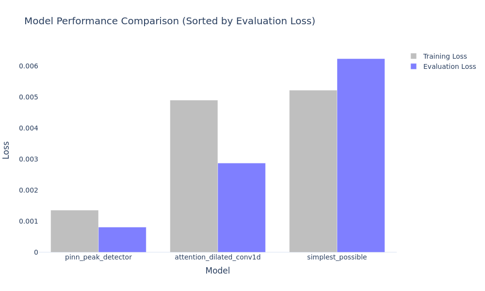
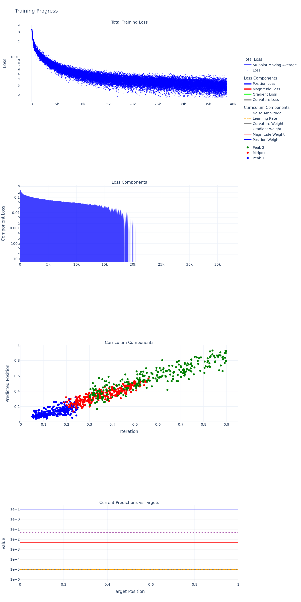

# Model Comparison Results

This directory contains performance metrics for three peak detection model architectures, each trained for 88,888 epochs under identical conditions.

## Model Overview

| Model | Parameters | Training Loss (1e-3) | Eval Loss (1e-3) |
|-------|------------|---------------------|------------------|
| PINN Peak Detector | 1.5M | 1.35 | 0.81 |
| Attention Dilated Conv1D | 412K | 4.90 | 2.87 |
| Simplest Possible | 131K | 5.21 | 6.23 | 


## Key Findings

1. **Performance vs Complexity**
   - **PINN Peak Detector**: Best accuracy (0.81e-3 eval loss) but highest complexity (1.5M params)
   - **Attention Dilated Conv1D**: Strong middle ground (2.87e-3 eval loss, 412K params)
   - **Simplest Possible**: Basic baseline with competitive results (6.23e-3 eval loss, 131K params)

2. **Training Behavior**
   

3. **Individual Training Curves**

   ### PINN Peak Detector Training
   - Rapid initial convergence in first 20K epochs
   - Smooth, stable training with consistent improvement
   - Reaches best performance (0.81e-3 loss)
   

   ### Attention Dilated Conv1D Training
   - Sharp learning in first 10K epochs
   - More variable loss curve but maintains downward trend
   - Plateaus earlier than PINN but achieves good stability (2.87e-3 loss)
   

   ### Simplest Possible Training
   - Quick initial descent but struggles to optimize further
   - Shows more noise in training curve
   - Reaches reasonable convergence (6.23e-3 loss) despite simple architecture
   

## Directory Structure
```
best_model_results/
├── model_comparison.png
├── pinn_peak_detector/
│   ├── figures/
│   └── metrics.json
├── attention_dilated_conv1d/
│   ├── figures/
│   └── metrics.json
└── simplest_possible/
    ├── figures/
    └── metrics.json
``` 